# Microgravity Field Data Processing System

[](https://www.mathworks.com/)
[](https://github.com/ewencai/microgravity-field-data-processing-system/releases)

**End-to-end microgravity field data processing and quality control system.** A unified 12-panel desktop application covering the complete workflow from raw instrument files to standardized deliverables — gravity data reshaping, GPS coordinate processing, point matching, 7-term gravity correction chain, quality control, progress statistics, and dual-format (Word + PPT) auto-generated reports.

## Overview

This system replaces fragmented scripts with an integrated, guided GUI for microgravity field data processing. It supports 4 gravimeter types, 3 GPS receiver models, and produces standardized multi-level deliverables.

### 12-Panel Tab Workflow

```
GRA Reshape → GPS Reshape → Point Match → Correction → Shift/Null
    → Dense Stats → QC Control → Closure Check → Progress Chart
    → Track → Daily Report → Project Summary
```

## Features

### Data Reshaping & Matching

**Gravity Data (GRA Reshape)** — 10 station type classification:
- Auto-detect 4 gravimeter formats: CG-5, CG-6, Burris-DD, Burris-JT
- Keyword dictionary classification: target / core / extension / infill / default / static / dynamic / round-trip / base (10 types)
- Structured output: `.xlsx` tables + `.txt` raw text lines + RawData archive
- Reading distribution heatmap, unit timeline visualization
- First/last point identity consistency check

**GPS Data (GPS Reshape)** — 3 receiver models:
- Auto-detect Huace E90 (41-column), X10, T7 (42-column)
- Column-mapping structure-driven format recognition
- User-extensible: add new receiver types via GUI ColMap editor
- Cross-instrument field guards (Role/Base compatibility)
- GBK encoding preservation for Chinese Windows
- Point distribution & elevation scatter visualization

**Point Matching (Match)**:
- Time baseline + survey line + point number matching
- Base/auxiliary/static point: control point + instrument matching
- LED-strip matching status scatter, closure-unit detail timeline
- Real-time success rate status indicator

### 7-Term Gravity Correction Chain

| # | Correction | Method |
|---|-----------|--------|
| 1 | **Drift** | Linear fit (slope/intercept) |
| 2 | **Solid tide** | Harmonic model |
| 3 | **Base difference** | Base station tie |
| 4 | **Free-air (height)** | 0.3086 mGal/m |
| 5 | **Latitude** | WGS84 formula |
| 6 | **Bouguer (slab)** | 2πGρh, configurable density |
| 7 | **Terrain** | Multi-body prism forward (4-step pipeline) |

Plus: scale factor correction, absolute gravity, quasi-Bouguer anomaly.

### Quality Control & Statistics

**Shift & Null**: Design-vs-actual offset error statistics, null-point identification, stakeout radius

**Dense Stats**: Infill point distribution, type composition, DEM input for terrain correction

**QC Control**: Elevation/plan/gravity QC error statistics (spatial + histogram views), 3-threshold bidirectional sync

**Closure Check**: AM/PM unit closure (direct + tide-corrected gravity, elevation, duration)

**Progress Chart** (daily, 11 sub-panels):
- Per-day measurement progress, hierarchical bar (all/survey/QC/infill, stacked & unstacked)
- Parameter trends: SD / tilt X,Y / duration / 3-point difference / over-limit
- GPS trends: PDOP/HDOP/VDOP / satellites / constellations / error
- Base station trends, checkpoint count & relative error
- 3-threshold lines with compliance direction triangles

**Track**: Field acquisition GPS trajectory replay

### Reporting

**Daily Report**: Auto-generated daily inspection report aligned with progress chart thresholds

**Project Summary** (KPI dashboard):
- Mixed data source (memory-priority, disk-fallback) full-survey KPIs
- Indicator table: design / measured / QC / null / infill / duplicate / non-conforming / duration
- Acquisition progress pie chart (with completion %), statistics histogram, QC non-conformance chart
- **Dual auto-report export**: Word (`.docx`, python-docx) + PPT (`.pptx`, python-pptx) from unified JSON model
- One-click archive: xcopy all pipeline outputs to standardized 12-level directory structure

## Technical Architecture

### Instrument Support

| Type | Models | Format |
|------|--------|--------|
| Gravimeter | CG-5, CG-6, Burris-DD, Burris-JT | Auto-detected |
| GPS Receiver | Huace E90 (41-col), X10, T7 (42-col) | Extensible |

### Processing Pipeline

- **18 statistical metrics** per vector
- **10 station types** (survey + QC)
- **12 standardized output directory levels**
- **Word + PPT** dual-report rendering (MATLAB JSON → Python python-docx/pptx or frozen .exe)
- **RSA-2048** license system: machine-fingerprint binding, offline verification, clock anti-rollback

### Defense-in-Depth

- Full-pipeline `isfield/exist/try-catch` guards
- Missing files/columns/empty tables degrade to defaults without crashing
- Path & parameter cross-session auto-persistence
- GBK-native encoding for Chinese Windows environments

## System Requirements

| Component | Requirement |
|-----------|-------------|
| OS | Windows 10/11 (64-bit) |
| Runtime | MATLAB Runtime R2026a |
| Report Engine | Bundled Python (python-docx, python-pptx) or frozen `.exe` |
| Memory | 8 GB recommended |
| License | Machine-bound RSA-2048 activation (first-launch prompt) |

## Download

Get the latest installer from [Releases](https://github.com/ewencai/microgravity-field-data-processing-system/releases).

## ScreenShots

### 1. Gravity Data Reshaping (CG-5/CG-6/Burris auto-detection, 10 station types)
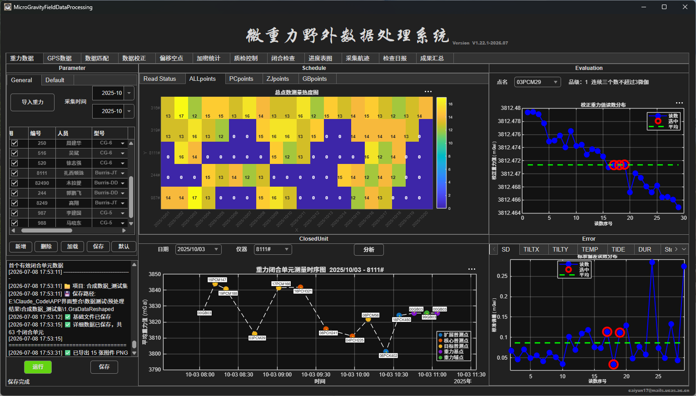

### 2. GPS Data Processing (Huace E90/X10/T7, extensible ColMap)
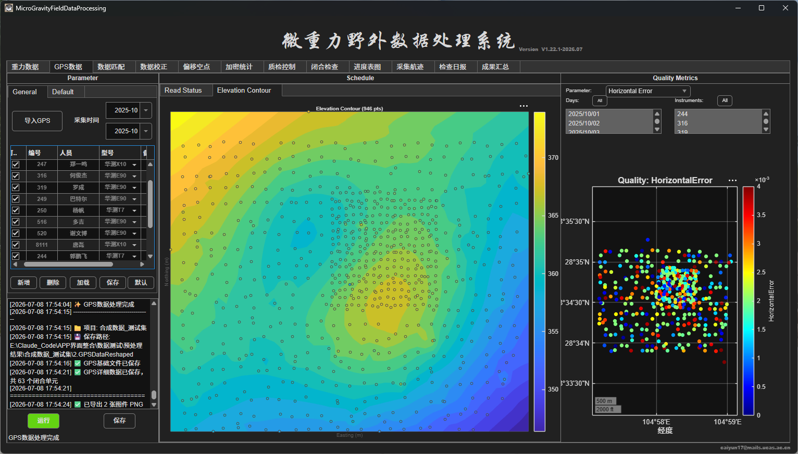

### 3. Point Matching (time baseline + survey line + point ID matching, closure unit detail timeline)
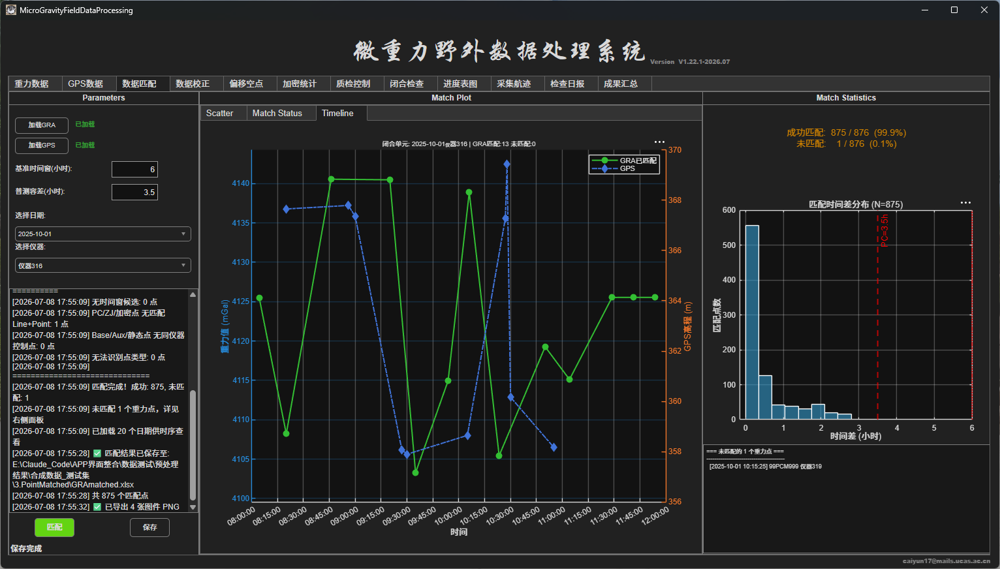

### 4. 7-Term Gravity Correction Chain
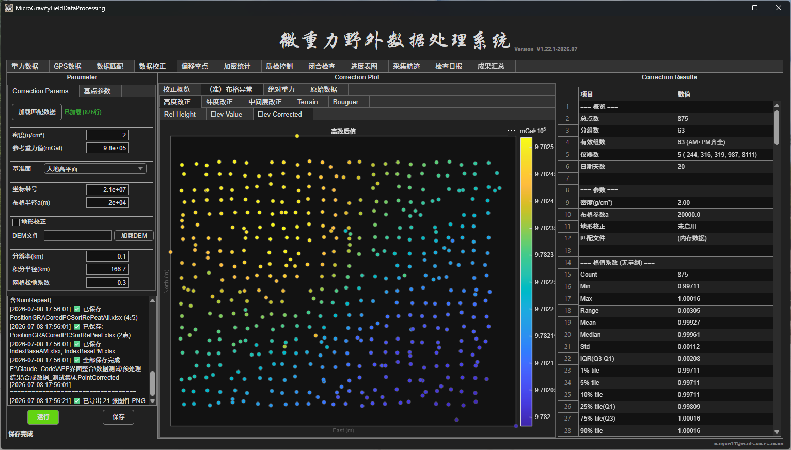

### 5. Shift & Null Analysis (design-vs-actual offset, stakeout radius)
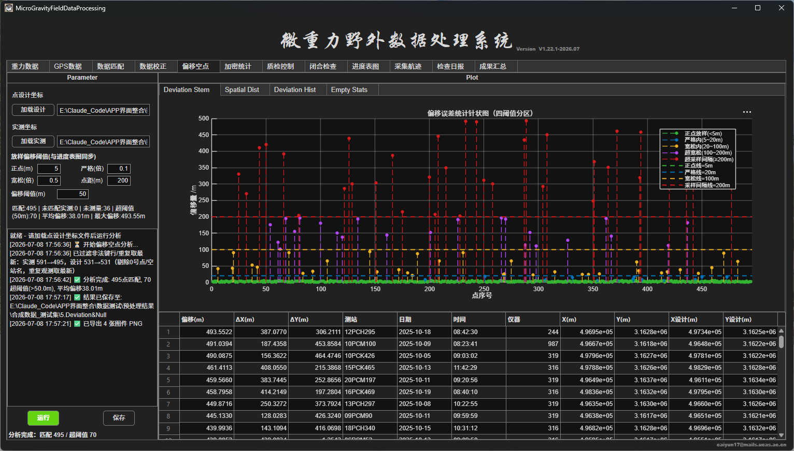

### 6. Infill Point Statistics & DEM Contribution
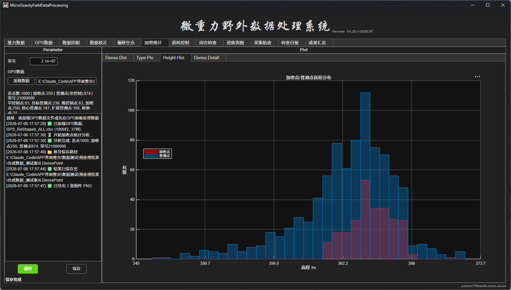

### 7. QC Control (elevation / plan / gravity error distribution, spatial + histogram)
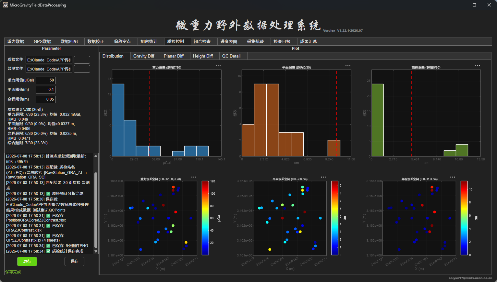

### 8. Closure Check (AM/PM gravity drift & elevation difference)
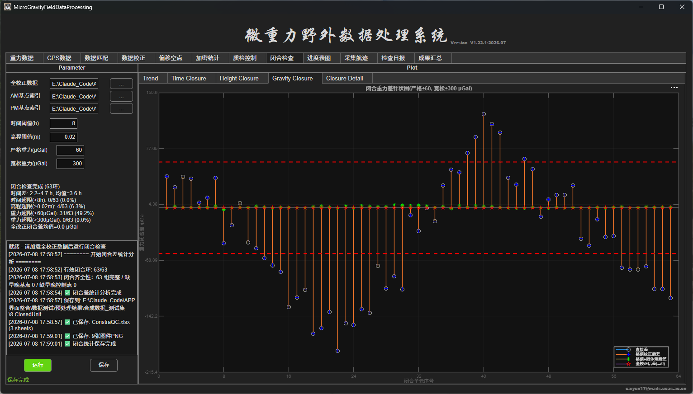

### 9. Daily Progress Charts (11 sub-panels, 3-threshold compliance monitoring)
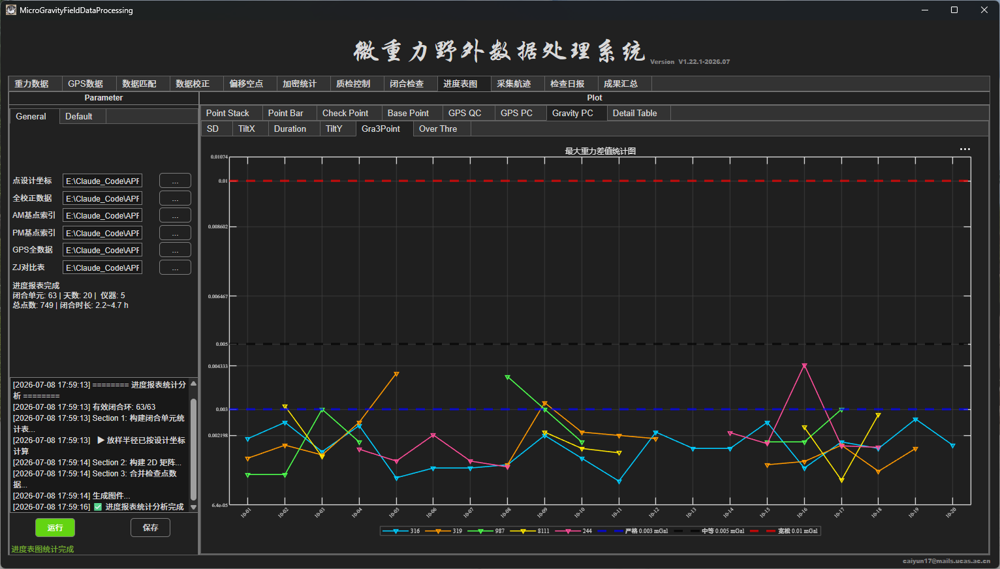

### 10. Field Acquisition Trajectory Replay
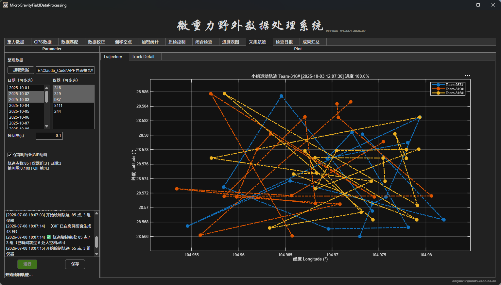

### 11. Daily Inspection Report (auto-aligned with progress thresholds)
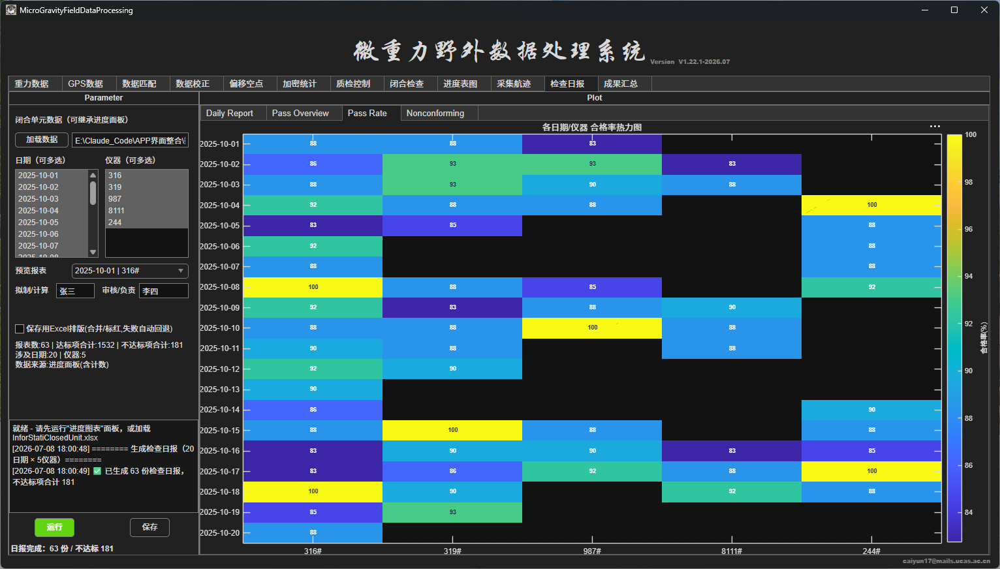

### 12. Project Summary KPI Dashboard & Auto-Generated Word/PPT Report
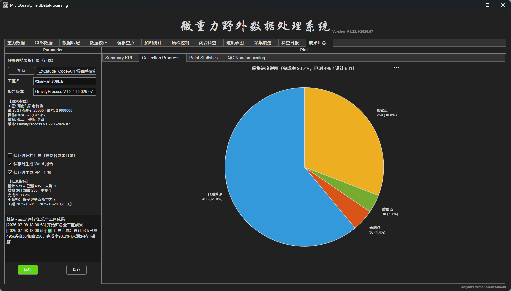

## Documentation

| Document | Content |
|----------|---------|
| [软件概要 (Software Overview)](docs/软件概要.md) | Architecture, 12-panel overview, instrument/chart/report capabilities, technical specifications |
| [功能清单 (Feature Checklist)](docs/功能清单.md) | ~97 detailed feature points across 4 modules (system, data, correction, reporting) |
| [安装与部署说明 (Deployment Guide)](docs/安装与部署说明.md) | Packaging prerequisites, source dependencies, Python report environment setup (2 options), MATLAB Runtime options, compilation steps, target-machine activation |
| [技术白皮书 (Technical Whitepaper)](docs/技术白皮书.md) | Technical architecture, algorithms, data flow |
| [用户操作手册 (User Manual)](docs/用户操作手册.md) | Step-by-step operation guide for each panel |

## Deployment Checklist (for packagers)

```
☐ Cat.png (window icon) — in additional files
☐ word_gen.exe / ppt_gen.exe (or .py scripts) — report renderers
☐ MATLAB Runtime R2026a — bundled or online-download
☐ License.key — post-install activation on target machine
☐ private_key.der / KeyToolV19.m — NEVER included in client package
```

---

*From raw CG-5/CG-6 file to stamped Word report — one guided pipeline, no scripting required.*
